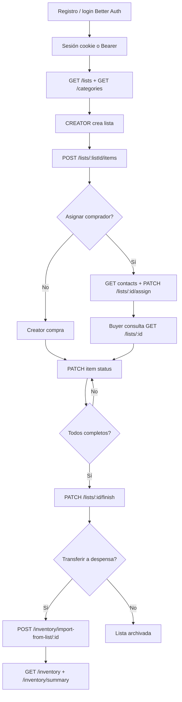

# Kompra — Arquitectura funcional y mapa técnico

> **Actualización del documento:** refleja el estado implementado después de la refactorización de seguridad, UX y desacoplamiento de módulos. Verificado contra el código actual de `apps/web` y `apps/api`.

> Documento generado a partir del código fuente real del repositorio. Cubre `apps/web` y `apps/api`, incluyendo rutas, componentes, controladores, servicios, DTOs, guards y entidades.
>
> **Estado del alcance:** el producto implementado es una plataforma colaborativa de listas de compras y registro histórico de despensa. No existen en el repositorio módulos de catálogo de productos comerciales, checkout, pagos, envíos, repartidores, notificaciones ni un panel administrativo independiente.

## Convenciones

- URL base del backend: `http://localhost:4000` por defecto.
- Prefijo global REST: `/api`; versionado URI: `/v1`; por tanto, los recursos se consumen como `/api/v1/...`.
- Autenticación: sesión Better Auth mediante cookie HTTP-only; el plugin Bearer permanece habilitado en backend para clientes compatibles.
- Todas las peticiones REST del frontend pasan por `apps/web/lib/api.ts`, que añade `Content-Type: application/json` y `credentials: include`. El frontend no persiste tokens sensibles en `localStorage`.
- Las respuestas de error REST se normalizan en `HttpExceptionFilter` como `{ timestamp, status, path, message }`.

# 1. Visión General y Arquitectura

## 1.1 Propósito y flujo de negocio

Kompra coordina encargos/listas asignadas entre una persona **CREATOR** (crea y administra listas) y personas **BUYER** (reciben una lista, consultan el progreso y marcan lo conseguido). En paralelo mantiene un inventario general para registrar compras de hogar, trabajo, vehículos, herramientas o proyectos. El flujo principal es:

1. Una persona se registra o inicia sesión con email y contraseña.
2. El frontend obtiene una sesión Better Auth y protege `/app`.
3. Al cargar `/app`, el layout y la superficie de listas sincronizan la identidad mediante `GET /users/me`, garantizando que exista el perfil de dominio y su `shareCode` antes de usar la red de contactos.
4. Un `CREATOR` crea una lista activa.
5. El creador añade productos clasificados por categoría y tipo de cantidad (`UNIT` o `WEIGHT`).
6. El creador puede vincular contactos por código y asignarles una lista.
7. El creador o el comprador asignado marca cada producto como completo o parcialmente completado. El creador también puede eliminar ítems mientras la lista está activa. Las transiciones se validan en una transacción con bloqueo pesimista.
8. Cuando todos los productos están resueltos, el creador finaliza la lista.
9. El usuario puede transferir opcionalmente los productos completados al inventario general; esta importación no es obligatoria para completar el flujo de listas y es transaccional e idempotente.
10. `/app/inventory` muestra el historial paginado y métricas del mes actual.

No hay flujo de venta a terceros: “compra” significa adquisición registrada por el usuario, no una orden comercial.

## 1.2 Arquitectura de alto nivel

```text
Next.js App Router / React / Tailwind
        │
        ├── Better Auth client ───────┐
        │                             │ sesión cookie HTTP-only
        └── apiFetch REST /api/v1 ────┼── NestJS 11 + Express
                                      │       │
                                      │       ├── AuthGuard / RolesGuard
                                      │       ├── DTO + ValidationPipe
                                      │       └── módulos por dominio
                                      │
                                      ├── TypeORM ── PostgreSQL Neon
                                      └── Better Auth/Kysely ── schema neon_auth
```

En producción, las operaciones Better Auth del navegador no llaman directamente
al subdominio de Neon. `apps/web/app/api/auth/[...all]/route.ts` funciona como
proxy same-origin: recibe `/api/auth/*`, reenvía método, query, body, cookies y
cabeceras HTTP relevantes al endpoint administrado de Neon Auth, y devuelve la
respuesta al navegador bajo el dominio de Vercel. El proxy elimina el atributo
`Domain` de cada `Set-Cookie` para que la cookie sea first-party de la aplicación.

En el inicio OAuth, el proxy reescribe el `redirect_uri` interno de Neon hacia
`/api/auth/callback/*`; así el callback también atraviesa Vercel y la cookie se
establece bajo el dominio de la aplicación. Las redirecciones externas hacia
Google se conservan sin modificación. Como el inicio social se ejecuta mediante
`fetch`, la UI solicita `disableRedirect: true` y navega explícitamente con
`window.location.assign(data.url)`; el proxy aplica la misma reescritura al
campo `url` del JSON `{ url, redirect }`.

El monorepo usa pnpm workspaces:

- `apps/web`: Next.js 15, React 19, TypeScript estricto, App Router, Tailwind CSS 4 y Lucide React.
- `apps/api`: NestJS 11, TypeScript, Express, TypeORM 0.3, class-validator, Swagger/OpenAPI, `@nestjs/throttler` y `helmet`.
- Base de datos: PostgreSQL en Neon. TypeORM utiliza `DATABASE_URL`, SSL y las entidades del dominio. Better Auth usa un pool `pg`, dialecto Kysely y el schema `neon_auth`.
- Calidad: Jest, Supertest, typecheck y builds coordinados desde el workspace.

## 1.3 Módulos backend

| Módulo | Responsabilidad |
|---|---|
| `AuthModule` | Registra `AuthGuard` y `RolesGuard` como guards globales. |
| `HealthModule` | Comprueba que la API responde y que PostgreSQL acepta `SELECT 1`. |
| `CategoriesModule` | Categorías por defecto y categorías personalizadas. |
| `UsersModule` | Perfil de dominio, código compartible y contactos bidireccionales. |
| `ListsModule` | Creación, consulta, asignación y finalización de listas. |
| `ItemsModule` | Alta, actualización de estado y eliminación de productos de listas. |
| `InventoryModule` | Compras manuales, consultas, agregados mensuales e importación desde listas. |

## 1.4 Autenticación y autorización

### Better Auth

`apps/api/src/auth/auth.ts` configura Better Auth con:

- Base path: `/api/v1/auth`.
- Registro email/contraseña habilitado y `autoSignIn: true`.
- Campo adicional `role`, por defecto `BUYER`, admitido durante el registro.
- Sesión de 7 días (`expiresIn`) y renovación de actividad cada día (`updateAge`).
- Rate limit propio de Better Auth: ventana de 60 segundos y máximo de 5 solicitudes, almacenado en memoria.
- Plugin `bearer()` para aceptar token.
- Cookies HTTP-only; en producción `secure: true` y `sameSite: none` para despliegues cross-subdomain con HTTPS; en desarrollo `secure: false` y `sameSite: lax`.
- Orígenes permitidos desde `TRUSTED_ORIGINS`.
- Identificadores UUID.

El cliente (`auth-client.ts`) utiliza `createAuthClient` contra el proxy
same-origin `/api/auth` y manda credenciales con `credentials: include`. La URL
se materializa como absoluta durante SSR/build para cumplir el contrato de
Better Auth, pero siempre apunta al origen actual de la aplicación. No almacena
el header `set-auth-token` ni tokens de sesión en `localStorage`; la sesión del
navegador se mantiene mediante cookie segura reescrita por el proxy.

### Protección HTTP y límites

- `ThrottlerModule` se registra globalmente con 60 solicitudes por 60 segundos como límite base para la API Nest.
- Better Auth aplica el límite específico de 5 solicitudes por 60 segundos a sus operaciones de autenticación.
- `helmet` se instala en el bootstrap con CSP base (`default-src 'self'`, `frame-ancestors 'none'`, `object-src 'none'`, scripts/estilos controlados, imágenes HTTPS/data y `connect-src` restringido).
- CORS acepta únicamente orígenes listados en `TRUSTED_ORIGINS`; en ausencia de variable se usa `http://localhost:3000` para desarrollo. Las credenciales permanecen habilitadas.

### Guards

1. `AuthGuard` es global. Si la ruta no tiene `@Public()`, obtiene la sesión con `auth.api.getSession({ headers: fromNodeHeaders(request.headers) })`. Si no existe, responde `401`; si existe, coloca `request.user` y `request.session`.
2. `RolesGuard` también es global. Lee `@Roles(...)`; sin metadata no restringe. Si el usuario no tiene uno de los roles requeridos responde `403`.
3. `@CurrentUser()` expone el usuario autenticado al controlador.
4. `@Public()` solo se usa en `GET /health` y `GET /categories`.

### Roles reales

| Rol | Capacidades |
|---|---|
| `CREATOR` | Crear listas, añadir/eliminar ítems, asignar listas, finalizarlas, crear categorías. Consulta y modifica sus listas. |
| `BUYER` | Consultar listas asignadas, cambiar estados de ítems de listas en las que participa, consultar/registrar su inventario y operar la red de contactos. |

No existe un rol `ADMIN`, `REPARTIDOR` ni un panel admin en el frontend. El seed llamado `seed-admin.ts` crea técnicamente un usuario `CREATOR`, no un rol administrativo distinto.

## 1.5 Persistencia y modelo de datos

| Entidad | Campos principales | Relaciones lógicas |
|---|---|---|
| `UserEntity` / `users` | `id`, `name`, `email`, `role`, `shareCode`, `createdAt` | Identidad de Better Auth por `id`; `shareCode` único. |
| `UserContactEntity` / `user_contacts` | `id`, `userId`, `contactId`, `createdAt` | Índice único por pareja; el servicio crea ambas direcciones. |
| `CategoryEntity` / `categories` | `id`, `name`, `color`, `icon`, `creatorId` | `creatorId=null` para categorías iniciales. |
| `ShoppingListEntity` / `shopping_lists` | `id`, `title`, `status`, `creatorId`, `assignedToId`, `createdAt`, `finishedAt` | Lista creada por un creator y opcionalmente asignada. |
| `ListItemEntity` / `list_items` | `id`, `listId`, `categoryId`, `name`, `quantityType`, `targetQuantity`, `status`, `purchasedQuantity`, `note`, `createdAt` | Producto perteneciente a una lista y categoría. |
| `InventoryPurchaseEntity` / `inventory_purchases` | `id`, `productName`, `categoryId`, `quantity`, `unit`, `purchaseDate`, `description`, `cost`, `sourceListId`, `sourceItemId`, `creatorId`, `createdAt` | `sourceItemId` único protege importaciones repetidas. |

Enums:

- Lista: `ACTIVE`, `FINISHED`.
- Ítem: `PENDING`, `PARTIALLY_COMPLETED`, `COMPLETED`.
- Cantidad de lista: `UNIT`, `WEIGHT`.
- Unidad de inventario: `kg`, `g`, `und`, `paquete`, `litro`.

## 1.6 Validación, errores y transacciones

La aplicación instala `ValidationPipe({ whitelist: true, forbidNonWhitelisted: true, transform: true })`. Los DTOs rechazan propiedades desconocidas y validan UUID, enums, longitudes, números positivos, fechas y formatos.

Se usan transacciones explícitas en:

- Actualización de estado de un ítem, con `pessimistic_write` sobre el ítem y `pessimistic_read` sobre la lista.
- Importación de productos de una lista finalizada, con protección por `sourceItemId`.

Excepciones de negocio frecuentes: `BadRequestException` (`400`), `UnauthorizedException` (`401`), `ForbiddenException` (`403`), `NotFoundException` (`404`) y `ConflictException` (`409`). Errores no controlados se convierten en `500`.

## 1.7 Integraciones y capacidades no implementadas

- **Pagos:** no hay Stripe, Mercado Pago, PayPal, webhooks ni endpoints de pago.
- **Envíos/reparto:** no hay proveedor, dirección, tracking ni rol repartidor.
- **Notificaciones:** no hay email transaccional, push, SSE, WebSocket ni cola de eventos.
- **Productos comerciales:** no hay catálogo, precio de venta, stock comercial ni carrito/checkout.
- **Administración:** no existe ruta `/admin`, CRUD de usuarios ni dashboard administrativo separado.

# 2. Mapa de Interfaces, Vistas y Componentes Interactivos

## 2.1 `/` — Landing pública

**Propósito:** presentar Kompra, mostrar el estado de conectividad del backend y dirigir al usuario al login, registro, listas o despensa.

**Acceso:** público; si hay sesión, ofrece navegación autenticada.

| Elemento | Tipo | Acción UI | Endpoint | Payload/parámetros | Respuesta / navegación |
|---|---|---|---|---|---|
| Iniciar sesión | Link | Abre formulario | — | — | `/login` |
| Registrarse | Link | Abre registro | — | — | `/register` |
| Ir a la App | Link condicional | Abre listas | — | — | `/app` |
| Crear una lista | Link | CTA principal | — | — | `/login` si es anónimo; `/app` si está autenticado |
| Explorar despensa | Link | CTA secundario | — | — | `/login` si es anónimo; `/app/inventory` si está autenticado |
| Cerrar sesión | Botón condicional | Ejecuta Better Auth sign-out y recarga la página | Better Auth `POST /api/v1/auth/sign-out` | Cookies/token de sesión | Estado anónimo y landing recargada |
| Indicador de backend | Estado informativo | Hace health check al montar | `GET /api/v1/health` | Sin body; timeout 3500 ms | `connected`, `checking` u `offline`; no bloquea navegación |

**Estados:** `connection` comienza en `checking`, pasa a `connected` si la respuesta es OK o `offline` si falla/vence el timeout.

## 2.2 `/login` — Inicio de sesión

**Componentes:** `LoginForm` y `AuthShell`. **Acceso:** público; si ya hay sesión, redirige a `/app`.

| Elemento | Tipo | Acción UI | Endpoint | Payload | Respuesta / navegación |
|---|---|---|---|---|---|
| Correo electrónico | Input email | Captura credencial | — | — | Validación HTML `required`. |
| Contraseña | Input password | Captura credencial | — | — | Validación HTML `required`. |
| Iniciar sesión | Form submit | Activa loader, limpia error y autentica | Better Auth `POST /api/v1/auth/sign-in/email` | `{ email, password }` | Sesión creada mediante cookie; `router.push('/app')` y refresh. |
| Crear cuenta | Link | Cambia al alta | — | — | `/register` |
| Volver al inicio / logo | Link | Navega a landing | — | — | `/` |

**Errores/estado:** `loading` deshabilita el botón y muestra spinner. Errores de Better Auth se presentan en alerta; excepciones de red muestran mensaje de conexión. `useSession` redirige automáticamente si la sesión ya existe.

## 2.3 `/register` — Registro

**Componentes:** `RegisterForm`, `AuthShell`. **Acceso:** público.

| Elemento | Tipo | Acción UI | Endpoint | Payload | Respuesta / navegación |
|---|---|---|---|---|---|
| Tu nombre | Input | Captura nombre | — | — | `required`. |
| Correo | Input email | Captura email | — | — | `required`. |
| Contraseña | Input password | Captura contraseña | — | — | `required`, mínimo 8 caracteres. |
| Creador / Comprador | Selector de botones | Establece `role` (`CREATOR` por defecto) | — | — | `aria-pressed`; solo cambia estado local. |
| Crear mi cuenta | Form submit | Registra y autentica | Better Auth `POST /api/v1/auth/sign-up/email` | `{ name, email, password, role }` | Better Auth crea sesión automáticamente; navega a `/app`. |
| Iniciar sesión | Link | Cambia al login | — | — | `/login` |

**Errores/estado:** `pending` muestra spinner y deshabilita submit. El callback `onError` coloca el mensaje Better Auth en `role="alert"`. Después de entrar a `/app`, el layout sincroniza el perfil de dominio mediante `/users/me`.

## 2.4 `/app` — Listas asignadas y coordinación de encargos

**Protección:** `app/layout.tsx` consulta `authClient.useSession`; durante carga muestra spinner y si no hay sesión/error redirige a `/login`. `middleware.ts` solo deja pasar la request y no autentica por sí mismo.

**Propósito:** listar las listas disponibles para el usuario, cargar el detalle de un encargo, añadir artículos, marcarlos, eliminarlos si es creador y finalizar la lista. El módulo no obliga a importar nada al inventario.

**Layout responsive actual:** en escritorio usa una composición de dos columnas a ancho completo: sidebar izquierdo con listas y acceso a inventario, y área derecha de trabajo. En móvil la barra lateral se sustituye por un selector compacto de lista dentro del encabezado.

### Carga inicial y navegación

| Elemento | Tipo | Acción | Endpoint | Payload/parámetros | Respuesta |
|---|---|---|---|---|---|
| Carga de listas | Efecto React | Solicita listas y categorías en paralelo | `GET /api/v1/lists`; `GET /api/v1/categories` | Sin parámetros | Listas visibles según rol; categorías ordenadas por nombre. |
| Selección de lista | Botón/list item | Cambia `selectedId` y carga detalle | `GET /api/v1/lists/:id` | `id` UUID | `{ list, itemsByCategory }`. |
| Despensa | Link | Abre historial | — | — | `/app/inventory` |
| Nueva lista | Botón desktop/móvil | Abre modal | — | — | `CreateListDialog`. |
| Cerrar sesión | Botón | Ejecuta Better Auth | `POST /api/v1/auth/sign-out` | Sesión | Redirige a `/login`. |
| Mi red | Botón flotante global | Abre `FriendNetwork` | — | — | Modal de contactos. |
| Asignar lista | Botón flotante global | Abre `ListAssignmentQuick` | — | — | Modal de asignación. |
| Nueva categoría | Botón flotante global | Abre `CategoryQuickCreate` | — | — | Formulario rápido. |

### Creación de lista

| Elemento | Tipo | Acción | Endpoint | Payload | Respuesta |
|---|---|---|---|---|---|
| Título | Input | Captura título | — | — | `required`, mínimo 2; backend `2..120`. |
| Crear lista | Form submit | Crea lista y recarga panel | `POST /api/v1/lists` | `{ title }` | `201`, lista `ACTIVE`; cierra modal y recarga. |
| X | Botón/modal | Cierra | — | — | No modifica servidor. |

Solo `CREATOR` puede completarla; un `BUYER` recibe `403`.

### Detalle y acciones de productos

| Elemento | Tipo | Acción | Endpoint | Payload | Respuesta / estado |
|---|---|---|---|---|---|
| Checkbox / nombre de ítem | Botón | Marca compra completa | `PATCH /api/v1/items/:id/status` | `{ status: "COMPLETED" }` | El backend fija `purchasedQuantity=targetQuantity`; se actualiza detalle/progreso. |
| Acción parcial | Botón | Abre modal de cantidad incompleta | — | — | `PartialDialog`; no llama hasta guardar. |
| Cantidad conseguida | Input number | Captura cantidad parcial | — | — | Mínimo `.001`, menor que el objetivo. |
| Nota aclaratoria | Textarea | Explica faltante | — | — | Obligatoria en la UI y backend para parcial. |
| Guardar completado parcial | Form submit | Persiste parcial | `PATCH /api/v1/items/:id/status` | `{ status: "PARTIALLY_COMPLETED", purchasedQuantity, note }` | Actualiza el ítem; `purchasedQuantity < targetQuantity`. |
| Ocultar completados | Switch-like button | Alterna `hideCompleted` | — | — | Filtrado local; no API. |
| Añadir producto | Botón | Abre `AddItemDialog` | — | — | Deshabilitado para lista `FINISHED`. |
| Producto | Input | Captura nombre | — | — | Requerido; backend `1..120`. |
| Categoría | Grupo de botones | Selecciona `categoryId` | — | — | Estado local. |
| Tipo cantidad | Selector/botones | `UNIT` o `WEIGHT` | — | — | Estado local. |
| Cantidad objetivo | Input number | Captura `targetQuantity` | — | — | Positiva, hasta 3 decimales. |
| Guardar producto | Form submit | Añade producto y recarga detalle | `POST /api/v1/lists/:listId/items` | `{ name, categoryId, quantityType, targetQuantity }` | `201`, ítem `PENDING`; cierra modal. |
| Papelera | Botón `Trash2` | Solicita confirmación y elimina el ítem; solo se renderiza para `CREATOR` | `DELETE /api/v1/items/:id` | Sin body | `204`; recarga listas y detalle. Se bloquea durante la petición. |
| Finalizar lista | Botón fijo condicional | Solo aparece si lista activa, total > 0 y todos completos | `PATCH /api/v1/lists/:id/finish` | Sin body | Lista pasa a `FINISHED`, se muestra banner de transferencia. |
| Transferir productos | Botón del banner | Importa completados/parciales | `POST /api/v1/inventory/import-from-list/:listId` | Sin body | Devuelve `imported`, `skipped`, `purchases`; limpia banner. |
| Ahora no | Botón | Descarta banner | — | — | No importa ni modifica lista. |

**Estados locales:** `loading` muestra spinner inicial; `busy` bloquea acciones de ítems/finalización; `error` muestra alerta descartable; los errores de los modales se muestran dentro de cada modal. La lista seleccionada y los filtros viven en React, no en URL ni almacenamiento persistente.

La importación al inventario es una acción opcional posterior a finalizar la lista: “Ahora no” cierra el aviso sin realizar ninguna importación.

## 2.5 Componentes globales de colaboración

### `FriendNetwork` — modal “Mi red”

| Elemento | Acción | Endpoint | Payload / respuesta |
|---|---|---|---|
| Abrir Mi red | Abre modal y carga datos | `GET /api/v1/users/me/code` | `{ shareCode, contacts }`. |
| Copiar | Copia `shareCode` al clipboard | — | Estado `copied` durante 1.6 s. |
| Código de contacto | Normaliza a mayúsculas | — | Formato esperado `KMP-XXXXX`. |
| Vincular amigo | Crea relación y vuelve a cargar red | `POST /api/v1/users/contacts/link` | `{ code }`; éxito muestra mensaje. |
| Cerrar / click fuera | Cierra modal | — | — |

Carga y vínculo muestran errores inline. El backend rechaza código inexistente (`404`), propio (`400`) o formato inválido (`400`).

### `ListAssignmentQuick` — asignación rápida

Al abrir realiza en paralelo `GET /api/v1/lists` y `GET /api/v1/users/contacts`; filtra listas activas. Dos selects eligen lista y contacto. “Asignar” invoca `PATCH /api/v1/lists/:id/assign` con `{ assignedToId }`. Requiere `CREATOR`, contacto válido y red previa para asignar BUYER. Mensajes de éxito/error son inline. X o click fuera cierran el modal.

### `CategoryQuickCreate` — categoría rápida

El botón abre un formulario con nombre (mínimo 2). Submit: `POST /api/v1/categories` con `{ name }`. El backend asigna color `#7C9A5B` e icono `tag` si no se envían. Éxito cambia temporalmente el botón a “Creada” y cierra a los 900 ms; `409` por duplicado u otros errores se muestran inline. Requiere `CREATOR`.

## 2.6 `/app/inventory` — Inventario general / registro de compras

**Propósito:** consultar compras del usuario, filtrar por texto/categoría, ver agregados mensuales y registrar manualmente cualquier adquisición: alimentos, herramientas, repuestos, ferretería o insumos de trabajo.

| Elemento | Tipo | Acción | Endpoint | Payload/parámetros | Respuesta |
|---|---|---|---|---|---|
| Volver a listas | Link | Regresa al tablero | — | — | `/app` |
| Registrar compra | Botón | Abre `PurchaseForm` | — | — | Modal. |
| Registrar primera compra | CTA empty state | Abre formulario | — | — | Modal. |
| Buscador | Input | Actualiza `search`; debounce 220 ms | `GET /api/v1/inventory? page=1&limit=50&search=...` | Query URL-encoded | Historial filtrado. |
| Filtro categoría | Select | Actualiza `categoryId`; debounce | `GET /api/v1/inventory?...&categoryId=UUID` | UUID | Historial filtrado. |
| Métricas | Cards informativas | Renderiza resumen mensual | `GET /api/v1/inventory/summary` | — | `totalItems`, `totalCost`, `byCategory`, etc. |
| Registrar compra | Form submit | Persiste compra y recarga | `POST /api/v1/inventory` | `{ productName, categoryId, quantity, unit, purchaseDate, description?, cost? }` | `201`, entidad creada; cierra modal. |
| Categoría | Botones | Selecciona categoría | — | — | Estado local. |
| Unidad | Select | Selecciona `kg`, `g`, `und`, `paquete`, `litro` | — | — | Estado local. |
| Fecha | Input date | Convierte fecha local a ISO | — | — | `purchaseDate` ISO. |
| Nota/costo | Inputs | Datos opcionales | — | — | Nota hasta 500; costo >= 0. |
| X | Botón | Cierra modal | — | — | — |

**Estados:** `loading` produce skeletons para métricas; el error se guarda en `error`; historial vacío muestra “Tu despensa empieza aquí”; cada búsqueda filtra tras 220 ms. La UI solicita límite 50 aunque el DTO admite hasta 100. No hay paginador visible: solo se carga la primera página.

## 2.7 Layout, rutas y pantallas administrativas

Rutas frontend reales: `/`, `/login`, `/register`, `/app`, `/app/inventory` y `/icon.svg`. `app/layout.tsx` define metadata, descripción de inventario general, `lang="es"` y enlaza el favicon SVG; `app/app/layout.tsx` protege el árbol, sincroniza `/users/me` y monta componentes globales.

No hay rutas `/admin`, `/admin/orders`, `/checkout`, `/payments`, `/delivery` ni pantallas para repartidores. El acceso se controla por guards/API, no por una UI administrativa dedicada.

# 3. Catálogo Completo de Endpoints y Servicios Backend

## 3.1 Formato común

- Salvo que se indique `@Public()`, requieren sesión válida mediante cookie o `Authorization: Bearer <session_token>`.
- El header `Content-Type: application/json` es necesario en cuerpos JSON.
- Los DTOs se validan globalmente y las propiedades extra provocan `400`.
- Respuesta genérica de error: `{"timestamp":"ISO-8601","status":400,"path":"/api/v1/...","message":"..."}`.

## 3.2 Health

### `GET /api/v1/health`

- **Auth:** pública.
- **Lógica:** `HealthService.check()` ejecuta `SELECT 1`.
- **200:** `{ "status":"ok", "database":"connected", "timestamp":"..." }`.
- **200 degradado:** `{ "status":"degraded", "database":"disconnected", "timestamp":"..." }` si la consulta falla; el servicio no lanza excepción.
- **Efectos:** solo lectura.

## 3.3 Auth / Better Auth

Better Auth se monta directamente con `toNodeHandler(auth)` bajo `/api/v1/auth`, por lo que sus rutas no están declaradas como controladores Nest. El código web utiliza, como mínimo:

| Método/ruta | Uso | Entrada | Resultado |
|---|---|---|---|
| `POST /api/auth/sign-up/email` | Registro | `{ name, email, password, role }` | Proxy Vercel → Neon Auth; crea identidad y cookie HTTP-only first-party. |
| `POST /api/auth/sign-in/email` | Login | `{ email, password }` | Proxy Vercel → Neon Auth; establece la cookie bajo el dominio web. |
| `POST /api/auth/sign-in/social` | Google OAuth | `{ provider: "google", callbackURL }` | Proxy conserva la redirección a Google y proxifica el callback. |
| `POST /api/auth/sign-out` | Logout | Sesión vigente | Proxy invalida sesión en Neon y retransmite `Set-Cookie`. |
| `GET /api/auth/get-session` | Hook `useSession` | Cookie HTTP-only first-party | Proxy consulta Neon y devuelve la sesión actual o ausencia. |

El endpoint upstream se toma de `NEXT_PUBLIC_NEON_AUTH_URL` y tiene como
respaldo explícito la URL administrada de Neon configurada para Kompra. El proxy
no envía metadatos internos de Next/Vercel como `x-forwarded-host`, evitando
respuestas `400` por validación de origen o URL en Neon Auth.

Los endpoints adicionales de Better Auth dependen del handler/versionado de la librería; no hay controladores custom que añadan recuperación de contraseña, OAuth o verificación de email. El frontend utiliza cookies y no persiste tokens en almacenamiento web.

## 3.4 Categorías

### `GET /api/v1/categories`

- **Auth:** pública.
- **Lógica:** devuelve todas las categorías ordenadas ascendentemente por `name`.
- **200:** `CategoryEntity[]`, cada elemento `{ id, name, color, icon, creatorId }`.
- **Efectos:** `CategoriesService.onModuleInit()` inserta siete categorías por defecto si la tabla está vacía: Víveres y alimentos, Frutas y verduras, Hogar y limpieza, Herramientas, Ferretería, Repuestos e Insumos de trabajo.

### `POST /api/v1/categories`

- **Auth:** requerida, rol `CREATOR`.
- **Body `CreateCategoryDto`:** `{ name: string(2..60), color?: /^#[0-9A-Fa-f]{6}$/, icon?: string(1..30) }`.
- **200:** `CategoryEntity` guardada (TypeORM normalmente responde `201` por `POST`).
- **400:** DTO inválido.
- **401/403:** sesión ausente / rol insuficiente.
- **409:** `Category already exists` si el nombre coincide.
- **Efectos:** inserta categoría asociada a `creatorId`; defaults `color=#7C9A5B`, `icon=tag`.

## 3.5 Usuarios y red de contactos

### `GET /api/v1/users/me`

- **Auth:** requerida, cualquier rol.
- **Lógica:** sincroniza/upsert de la identidad Better Auth en `users`; normaliza cualquier rol distinto de `CREATOR` a `BUYER`; genera `shareCode` determinista `KMP-` + primeros 5 caracteres del UUID sin guiones.
- **200:** `{ user: { id, name, email, role, createdAt }, session: { userId } }`.
- **401:** sesión ausente.
- **Efectos:** upsert de usuario de dominio.

### `GET /api/v1/users/me/code`

- **Auth:** requerida.
- **Lógica:** garantiza el perfil y el código; devuelve contactos del usuario.
- **200:** `{ shareCode: string, contacts: UserEntity[] }`.
- **404:** `User profile not found` si no existe la fila de dominio.

### `GET /api/v1/users/contacts`

- **Auth:** requerida.
- **200:** array de usuarios vinculados bidireccionalmente.
- **Efectos:** lectura.

### `POST /api/v1/users/contacts/link`

- **Auth:** requerida.
- **Body `LinkContactDto`:** `{ code: string }`, longitud 9 y regex `^KMP-[A-Z0-9]{5}$`.
- **201/200:** usuario de contacto vinculado.
- **400:** código propio o body inválido.
- **404:** código no encontrado.
- **Efectos:** crea dos filas en `user_contacts` (`A→B` y `B→A`) si no existe la primera relación.

## 3.6 Listas

### `POST /api/v1/lists`

- **Auth:** requerida, `CREATOR`.
- **Body `CreateListDto`:** `{ title: string(2..120), assignedToId?: UUID }`.
- **201:** lista `{ id, title, status:"ACTIVE", creatorId, assignedToId, createdAt, finishedAt:null }`.
- **400:** DTO inválido o usuario asignable inválido.
- **401/403:** sesión/rol.
- **404:** usuario asignado inexistente.
- **Efectos:** inserta lista; si se pasa `assignedToId`, valida rol y red de contactos para BUYER.

### `GET /api/v1/lists`

- **Auth:** requerida, cualquier rol.
- **Lógica:** `CREATOR` ve listas cuyo `creatorId` es propio; `BUYER` ve listas cuyo `assignedToId` es propio. Orden `createdAt DESC`. Agrega conteos SQL de total y completados.
- **200:** array de listas con `totalItems` y `completedItems`.
- **Efectos:** lectura.

### `GET /api/v1/lists/:id`

- **Auth:** requerida, solo creador o comprador asignado.
- **Lógica:** obtiene lista, ítems en orden de creación y categorías; agrupa como `itemsByCategory: Record<categoryId, { category, items }>`.
- **200:** `{ list, itemsByCategory }`.
- **401/403:** sesión o participación inválida; protege contra IDOR.
- **404:** lista inexistente.

### `PATCH /api/v1/lists/:id/assign`

- **Auth:** requerida, `CREATOR` y creador propietario de la lista.
- **Body `AssignListDto`:** `{ assignedToId: UUID }`.
- **200:** lista actualizada.
- **400:** usuario no tiene rol `BUYER`/`CREATOR`.
- **403:** no es creador o el BUYER no pertenece a la red.
- **404:** lista/usuario no encontrado.
- **Efectos:** actualiza `assignedToId`.

### `PATCH /api/v1/lists/:id/finish`

- **Auth:** requerida, `CREATOR` propietario.
- **Body:** ninguno.
- **200:** lista con `status:"FINISHED"` y `finishedAt` ISO.
- **403/404:** autorización/recurso.
- **Efectos:** cambia estado; es idempotente si ya estaba finalizada (devuelve la lista sin cambios).

## 3.7 Ítems de lista

### `POST /api/v1/lists/:listId/items`

- **Auth:** requerida, `CREATOR` propietario.
- **Body `CreateItemDto`:** `{ name: string(1..120), categoryId: UUID, quantityType: "UNIT"|"WEIGHT", targetQuantity: number >= .001, note?: string(0..500) }`.
- **201:** ítem con `status:"PENDING"`, `purchasedQuantity:0`, `note` nullable.
- **400:** DTO inválido o lista finalizada.
- **403:** no es propietario.
- **404:** lista o categoría inexistente.
- **Efectos:** inserta en `list_items`.

### `PATCH /api/v1/items/:id/status`

- **Auth:** requerida, creador o comprador asignado a la lista.
- **Body `UpdateItemStatusDto`:** `{ status: "PENDING"|"PARTIALLY_COMPLETED"|"COMPLETED", purchasedQuantity?: number >= .001, note?: string(1..500) }`.
- **200:** ítem actualizado.
- **400:** parcial sin cantidad, cantidad parcial mayor/igual al objetivo, nota parcial vacía, DTO inválido o lista finalizada.
- **401/403:** sesión o participación inválida.
- **404:** ítem/lista inexistente.
- **Transacción:** bloqueo de escritura del ítem y lectura de la lista; `COMPLETED` fija cantidad objetivo, `PENDING` fija 0 y parcial conserva la cantidad recibida.

### `DELETE /api/v1/items/:id`

- **Auth:** requerida, `CREATOR` propietario.
- **Body:** ninguno.
- **204:** eliminado sin payload.
- **400:** lista finalizada.
- **403/404:** autorización/recurso.
- **Efectos:** borra el ítem. La UI lo expone con papelera y confirmación exclusivamente al `CREATOR`.

## 3.8 Inventario / despensa

### `POST /api/v1/inventory`

- **Auth:** requerida, cualquier usuario autenticado.
- **Body `CreateInventoryPurchaseDto`:** `{ productName: string(1..120), categoryId: UUID, quantity: number >= .001 con <=3 decimales, unit: "kg"|"g"|"und"|"paquete"|"litro", purchaseDate: ISO date-time, description?: string(0..500), cost?: number >=0 con <=2 decimales }`.
- **201:** entidad con `creatorId`, `sourceListId:null`, `sourceItemId:null`.
- **400:** validación/fecha/unidad/cantidad.
- **404:** categoría no encontrada.
- **Efectos:** inserta compra manual.

### `GET /api/v1/inventory`

- **Auth:** requerida.
- **Query `InventoryQueryDto`:** `startDate?`, `endDate?` ISO; `categoryId?` UUID; `search?` texto; `page` >=1 default 1; `limit` 1..100 default 20.
- **200:** `{ data: InventoryPurchaseEntity[], meta: { page, limit, total, totalPages } }`.
- **Lógica:** filtra siempre por `creatorId` actual; búsqueda `ILIKE` por nombre; ordena `purchaseDate DESC`; usa `skip/take`.
- **400:** query inválida.
- **Efectos:** lectura.

### `GET /api/v1/inventory/summary`

- **Auth:** requerida.
- **200:** `{ month:"YYYY-MM", totalItems, totalQuantity, totalCost, byCategory:[{ categoryId, categoryName, color, count, percentage }] }`.
- **Lógica:** solo compras del mes UTC actual del usuario; agrupa por categoría y suma cantidades/costos.
- **Efectos:** lectura.

### `POST /api/v1/inventory/import-from-list/:listId`

- **Auth:** requerida, creador o comprador asignado.
- **Body:** ninguno.
- **201:** `{ imported: number, skipped: number, purchases: InventoryPurchaseEntity[] }`.
- **400:** lista no finalizada.
- **403:** no participa en la lista.
- **404:** lista inexistente.
- **Transacción:** selecciona ítems `COMPLETED` o `PARTIALLY_COMPLETED`; por cada `sourceItemId` existente incrementa `skipped`; los nuevos usan cantidad comprada, unidad `kg` para `WEIGHT` o `und` para `UNIT`, fecha de finalización/creación, nota y referencias de origen.
- **Idempotencia:** índice único `sourceItemId` y comprobación previa impiden duplicar importaciones.

# 4. Diagrama de Flujo de Datos y Estados

## 4.1 Flujo principal



## 4.2 Estados de entidades

### Lista

```text
ACTIVE ── PATCH /lists/:id/finish ──> FINISHED
```

- Una lista nueva siempre nace `ACTIVE`.
- Solo el creador puede finalizarla.
- Una lista `FINISHED` no admite añadir/eliminar ítems ni actualizar estados.
- La finalización es idempotente.
- La importación a inventario no cambia el estado de la lista.

### Ítem

```text
PENDING ── completar objetivo ──> COMPLETED
PENDING ── cantidad menor + nota ──> PARTIALLY_COMPLETED
PARTIALLY_COMPLETED ── completar objetivo ──> COMPLETED
PARTIALLY_COMPLETED ── volver pendiente ──> PENDING (cantidad 0)
COMPLETED ──> (la UI no permite nuevas acciones; API sí valida DTO y lista activa)
```

Reglas efectivas:

- `COMPLETED`: `purchasedQuantity = targetQuantity`.
- `PENDING`: `purchasedQuantity = 0`.
- `PARTIALLY_COMPLETED`: `0 < purchasedQuantity < targetQuantity` y nota no vacía.
- Todas las transiciones se guardan dentro de una transacción para evitar carreras concurrentes.

### Compra de inventario

```text
Compra manual ── POST /inventory ──> inventory_purchases
Ítem resuelto + lista FINISHED ── importación ──> inventory_purchases
Importación repetida ── sourceItemId existente ──> SKIPPED (sin duplicado)
```

Una compra de inventario no tiene estados de pago, envío ni entrega; es un registro histórico inmutable desde la API actualmente expuesta.

## 4.3 Seguridad y aislamiento de datos

- Las listas se filtran por creador o asignado, y `getAuthorizedList` se ejecuta antes de exponer detalle o mutar recursos.
- Los ítems se autorizan indirectamente por su lista; no basta con conocer un UUID.
- El inventario siempre se filtra por `creatorId` del usuario autenticado.
- La asignación de un BUYER exige una relación en `user_contacts`.
- Categorías son públicas para lectura, pero su creación exige `CREATOR`.
- La validación de entrada está centralizada y no permite campos extra.

## 4.4 Observaciones de implementación

- TypeORM usa `synchronize: true` solo cuando `NODE_ENV === 'development'`; fuera de desarrollo queda desactivado. No hay archivos de migración en el repositorio.
- El frontend dispone de estados de carga y error, pero no implementa polling, realtime, reconciliación offline ni caché persistente.
- La documentación Swagger se publica en `/api/docs` mientras la API está activa y configura Bearer Auth con formato `session_token`.
- Los seeds son opcionales: `seed-admin` crea/sincroniza un creador y `seed-market` agrega una lista y productos de ejemplo.

## 4.5 Estado posterior a la refactorización

- El módulo de listas es autónomo: finalizar una lista no ejecuta automáticamente ninguna escritura en inventario; la transferencia se inicia únicamente desde el banner opcional de la interfaz.
- El módulo de inventario ya no se presenta como una despensa exclusiva de supermercado. Sus categorías iniciales y textos de UI cubren alimentos, hogar, herramientas, ferretería, repuestos e insumos de trabajo.
- El creador dispone de eliminación de ítems desde cada fila mediante `Trash2`; el endpoint `DELETE /api/v1/items/:id` permanece protegido en backend y la UI no lo muestra a compradores.
- Se retiró el botón visual sin comportamiento “Más opciones”.
- La identidad de dominio se sincroniza antes de montar las herramientas globales de colaboración, por lo que `shareCode` existe antes de abrir “Mi red”.
- La API tiene límite base global de 60 solicitudes por minuto y límite de autenticación de 5 por minuto; ambos son limitadores en memoria y deben sustituirse por almacenamiento compartido si se escala horizontalmente.
- El frontend utiliza cookies de sesión con `credentials: include`; el token Bearer sigue disponible como compatibilidad de API, pero no se guarda en `localStorage`.
- El favicon nativo se encuentra en `apps/web/app/icon.svg` y está enlazado desde la metadata de `apps/web/app/layout.tsx`.
